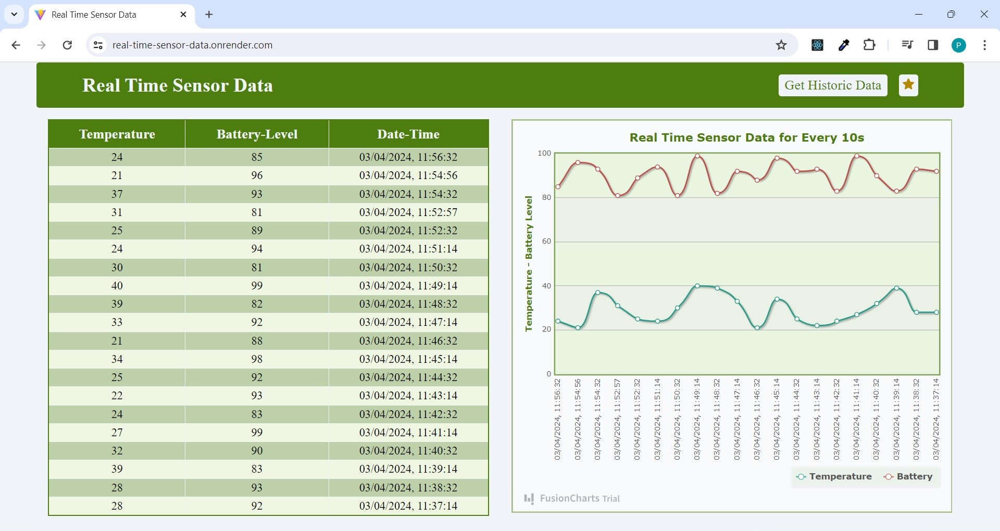
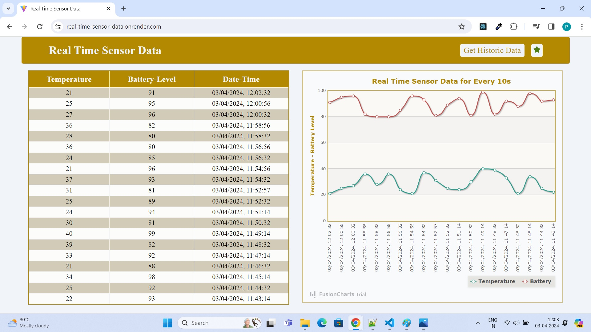
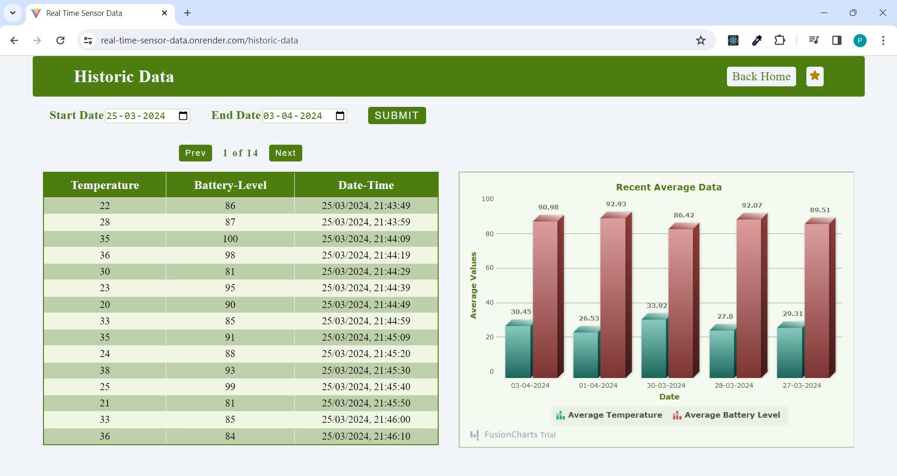
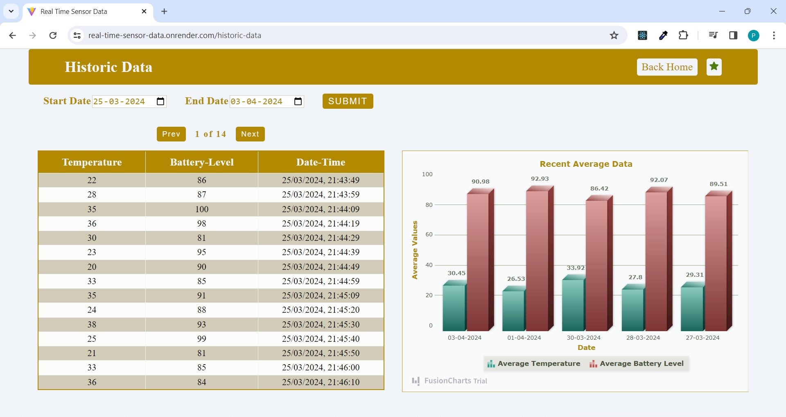

## Real Time Sensor Data

App for displaying the data from sensors. The data is fetched every 2mins and displayed in both table and chart formats.
The app uses web sockets to display data in real time.

#### Features

- Real-time data display
- Tables and Charts for data
- Can Access Historic Data
- Change color or theme

#### Tech Stack

- Front-End

  - React
  - React-router-dom
  - axios
  - Fusion Charts
  - Socket.io

- Back-End
  - Node / Express
  - Mongodb / Mongoose
  - Socket.io

### Images

#### Home Page

#### Historic Data Page

